## 计算机毕业设计Python+Neo4j地铁盾构施工项目风险分析知识图谱可视化 Python爬虫 机器学习 深度学习 人工智能 大数据毕业设计

## 要求
### 源码有偿！一套(论文 PPT 源码+sql脚本+教程)

### 
### 加好友前帮忙start一下，并备注github有偿纯python地铁盾构
### 我的QQ号是2827724252或者798059319或者 1679232425或者微信:bysj2023nb 或bysj1688

# 

### 加qq好友说明（被部分 网友整得心力交瘁）：
    1.加好友务必按照格式备注
    2.避免浪费各自的时间！
    3.当“客服”不容易，repo 主是体面人，不爆粗，性格好，文明人。

### 功能
1数据收集与预处理：通过文献检索、案例收集、实地调研等方式，获取地铁盾构施工相关的知识资源，并进行数据清洗和预处理。
2知识图谱构建：利用NLP和机器学习技术，从知识资源中提取实体、关系等关键信息，构建地铁盾构施工风险知识图谱。
3风险分析模型开发：基于知识图谱，设计并实现风险分析模型，包括风险识别、量化评估和优先级排序等算法。
4风险可视化系统开发：利用Django框架和Echarts等可视化工具，开发风险可视化系统的用户界面和功能模块。
5系统测试与优化：选取实际地铁盾构施工项目进行测试，根据测试结果对系统进行优化和改进。

## 演示视频
https://www.bilibili.com/video/BV142421Z7Nj/?spm_id_from=333.999.0.0

## 演示图

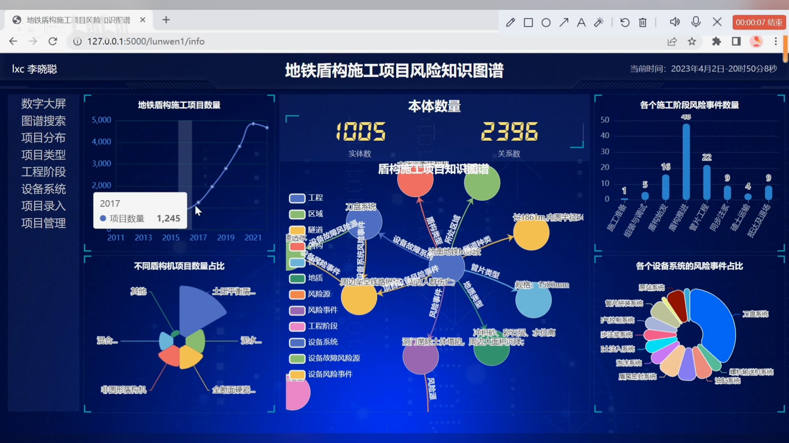
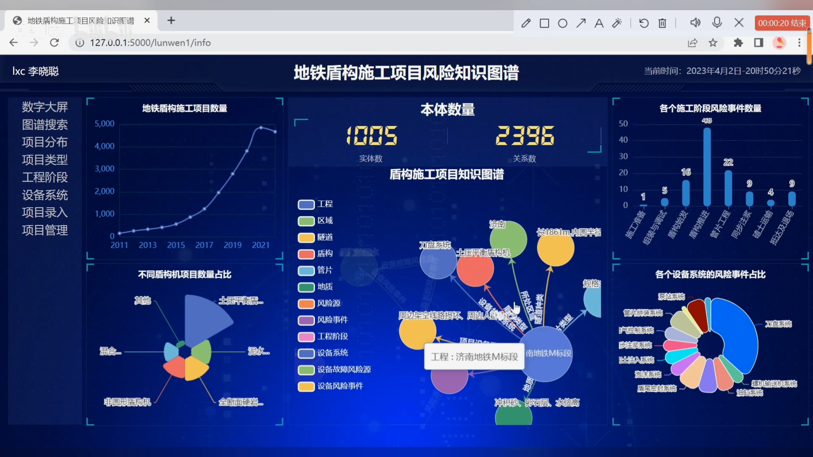
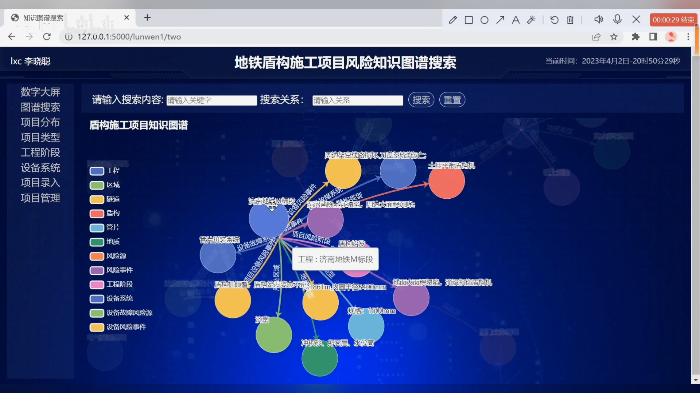
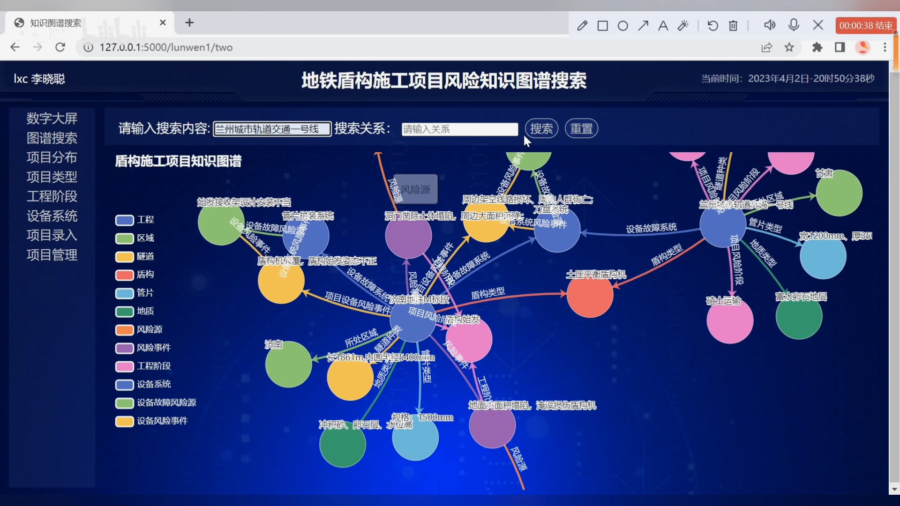
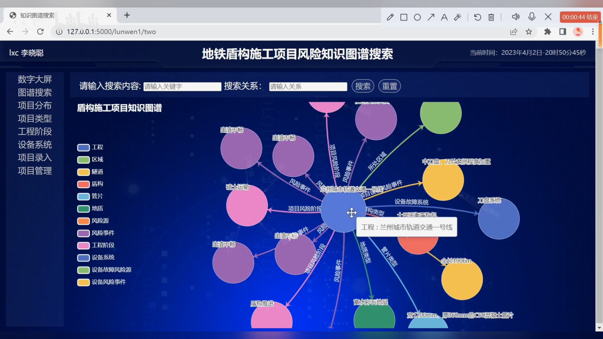
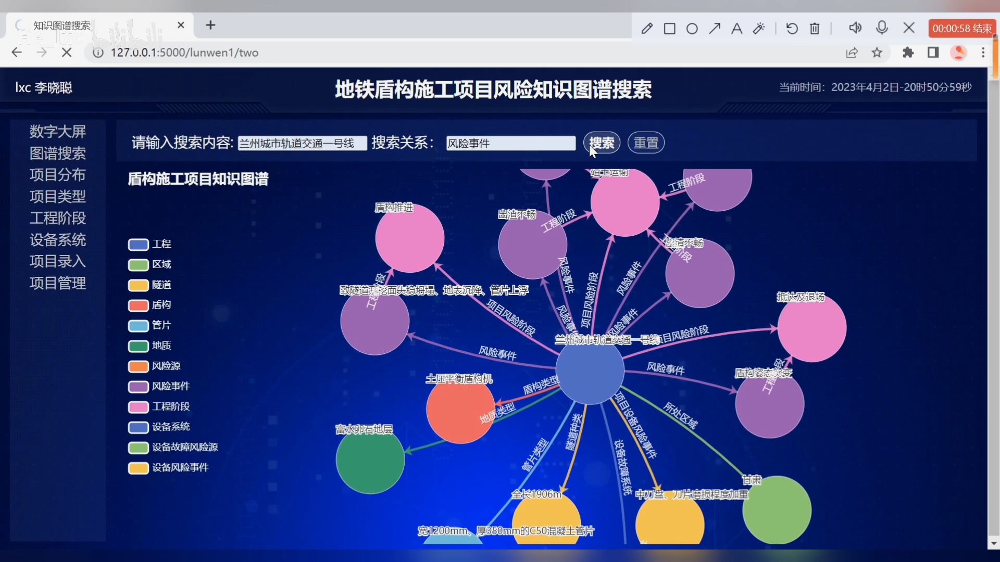
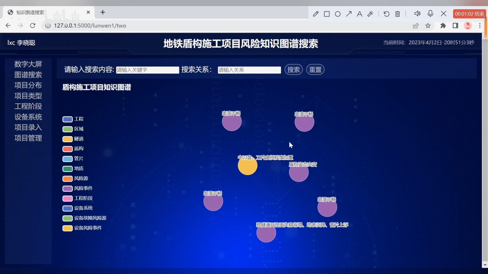
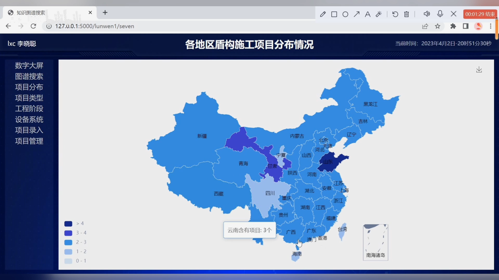
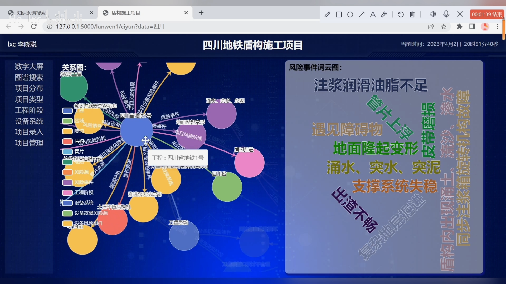

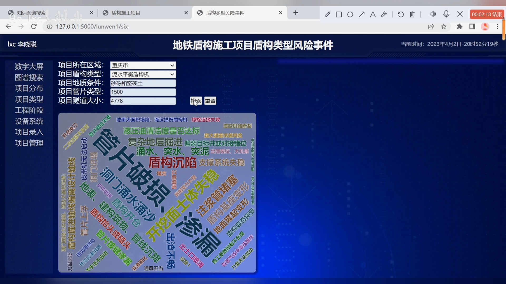
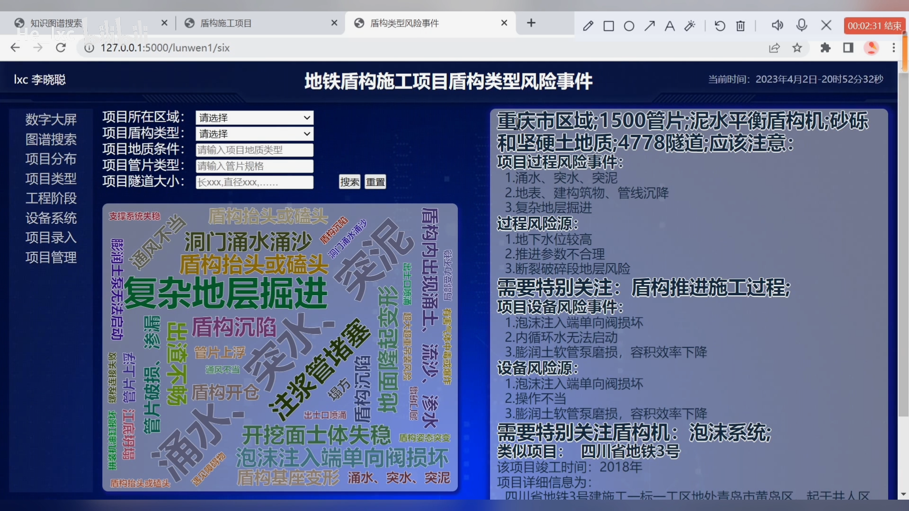
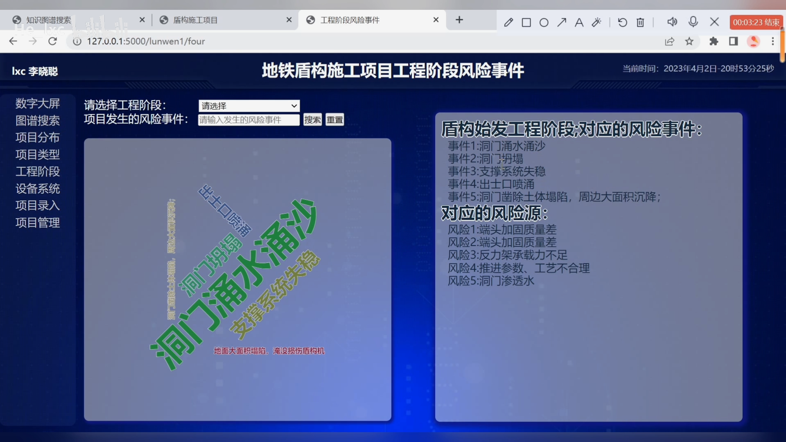
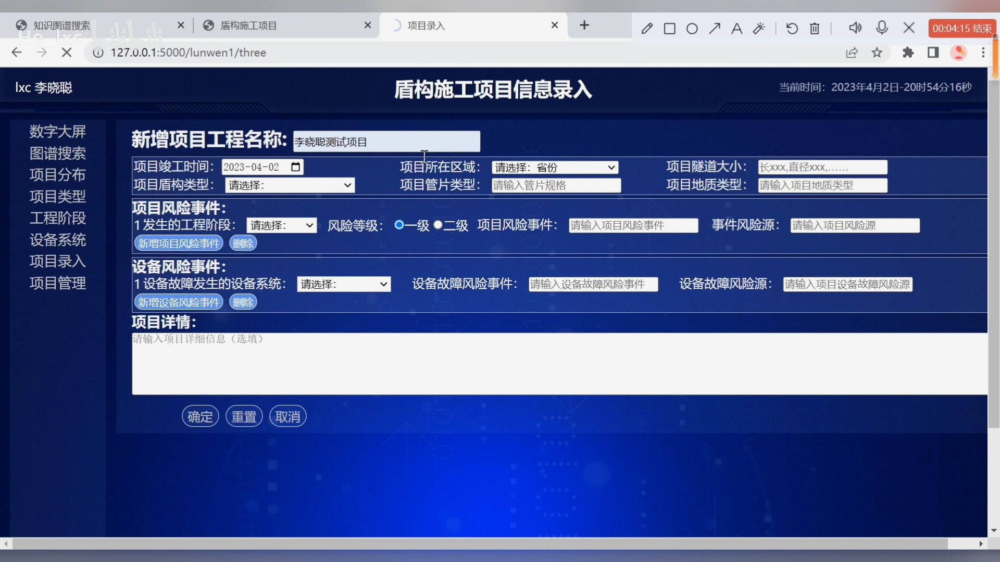
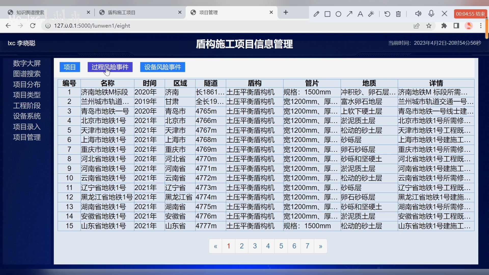
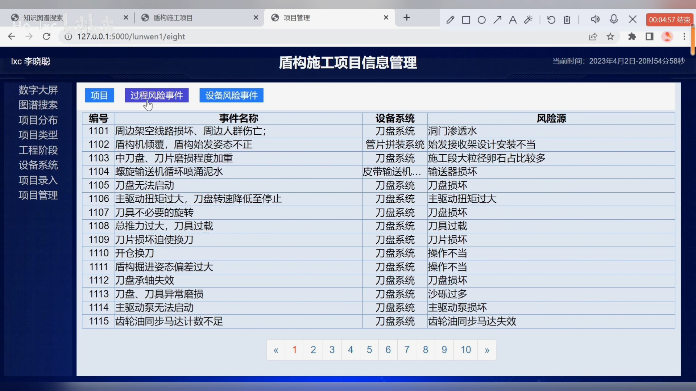

